# 1. Gestion des services : `systemd`
- utilisation de la commande `man systemctl` pour voir le manuel.  
 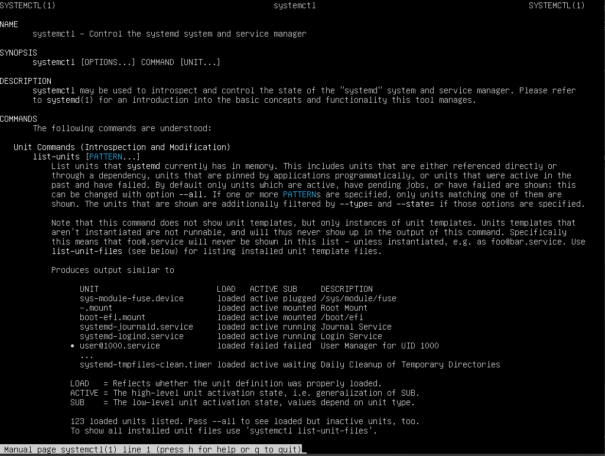  

- utilisation de la commande `systemctl` pour voir les processus lancés par systemd.  
 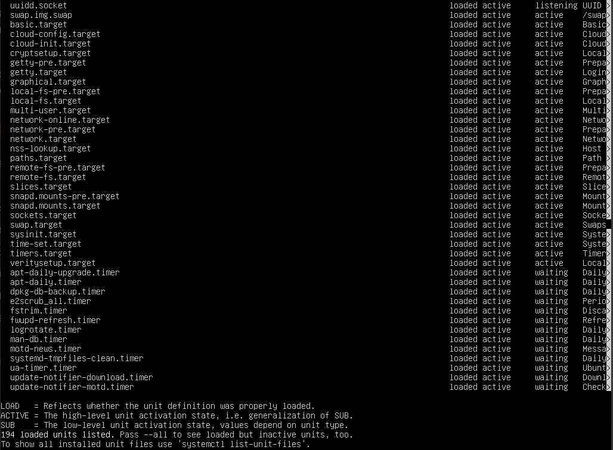  

- connexion sur la Vm depuis mon ordinateur personel pour vérifier le `sshd` avec la commande `ssh -l iut 10.31.33.172`.  
 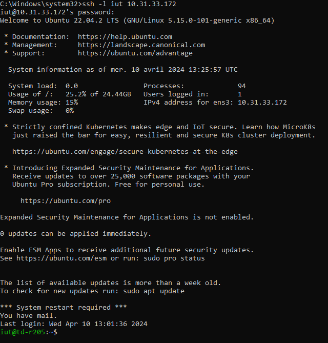  

- arrêt de la Vm avec la commande `sudo service sshd stop` puis tentative de connexion depuis ma machine personelle avec `ssh -l iut 10.31.33.172`.  
 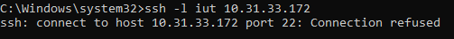  

- redémarrage du service `sshd` avec la commande `sudo service sshd start`.  

# 2. Serveur Web Apache
## 2.1. Configuration de base
- installation du paquet `apache2` avec la commande `sudo apt-get install apache2`.  

- vérification de `apache2` :  
 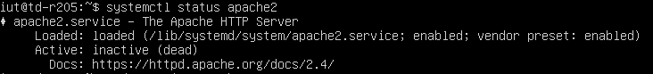  

- démarrage du service `apache2` avec la commande `sudo service apache2 start`.  

- re-vérification de `apache2` :  
 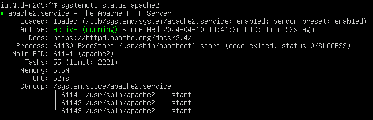  

- Ecploration du dossier `/etc/apache2` avec la commande `ls /etc/apache2`.  
 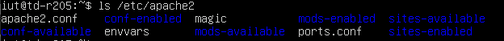  

- utilisation de la commande `a2enmod userdir` pour activer le module `apache2` : `userdir`.  
 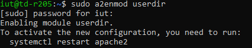  

- redémarrage de `apache2` avec la commande `systemctl restart apache2`.  
 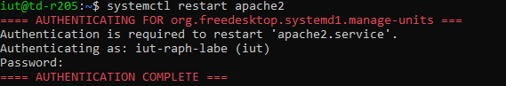  

- création du dossier `public_html` dans `iut` avec la commande `mkdir public_html`.  

Difficultés pour donner les droits d'accès aux dossiers.

- don des droit d'accès au dossier `iut/` avec la commande `chmod 777 iut`.  
- *changement* : utilisation de la commande `setfacl -m d:www-data:rw /hme/iut/`

- don des droit d'accès au dossier `public_html/` avec la commande `chmod 777 public_html`.  
- *changement* :  utilisation de la commande `setfacl -m d:www-data:rw /hme/iut/public_html/`

Difficultés pour comprendre ce qu'est `Indexes` et trouver la bonne ligne.

- suppression de la ligne contenant l'option `Indexes` en accédant au fichier avec la commande `sudo nano /etc/apache2/apache2.conf` :  
   
 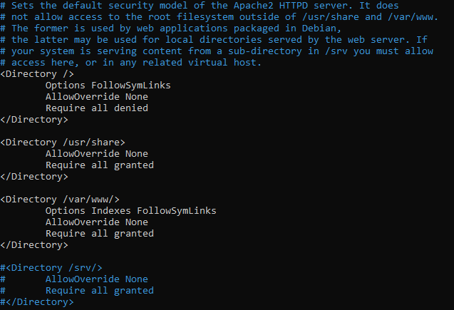  

- création du fichier `bienvenu.html` avec la commande `nano public_html/bienvenue.html` puis accès par l'adresse :  
 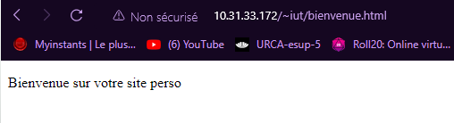  

## 2.2 Les serveurs virtuels

- syntaxe accès site : `http://10.31.33.172/~iut`  

- vue des noms `DNS` :  
 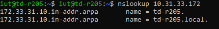