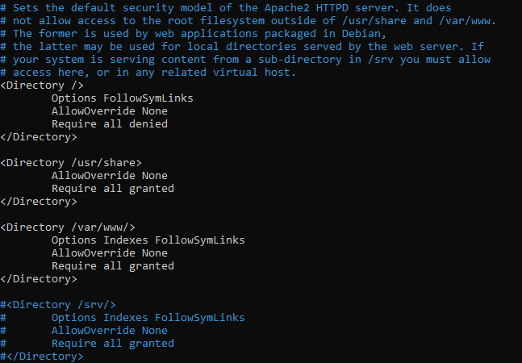
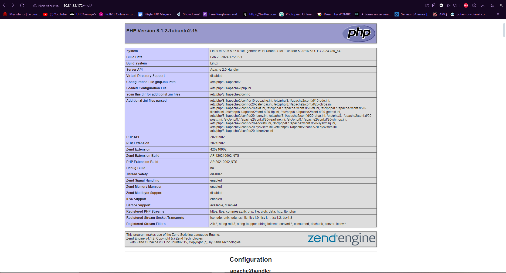

# 1. Gestion des services : `systemd`
- utilisation de la commande `man systemctl` pour voir le manuel.  
   

- utilisation de la commande `systemctl` pour voir les processus lancés par systemd.  
   

- connexion sur la Vm depuis mon ordinateur personel pour vérifier le `sshd` avec la commande `ssh -l iut 10.31.33.172`.  
   

- arrêt de la Vm avec la commande `sudo service sshd stop` puis tentative de connexion depuis ma machine personelle avec `ssh -l iut 10.31.33.172`.  
   

- redémarrage du service `sshd` avec la commande `sudo service sshd start`.  

# 2. Serveur Web Apache
## 2.1. Configuration de base
- installation du paquet `apache2` avec la commande `sudo apt-get install apache2`.  

- vérification de `apache2` :  
   

- démarrage du service `apache2` avec la commande `sudo service apache2 start`.  

- re-vérification de `apache2` :  
   

- Exploration du dossier `/etc/apache2` avec la commande `ls /etc/apache2`.  
   

- utilisation de la commande `a2enmod userdir` pour activer le module `apache2` : `userdir`.  
   

- redémarrage de `apache2` avec la commande `systemctl restart apache2`.  
   

- création du dossier `public_html` dans `iut` avec la commande `mkdir public_html`.  

Difficultés pour donner les droits d'accès aux dossiers.

- don des droit d'accès au dossier `iut/` avec la commande `chmod 777 iut`.  
- *changement* : utilisation de la commande `setfacl -m d:www-data:rw /home/iut/`

- don des droit d'accès au dossier `public_html/` avec la commande `chmod 777 public_html`.  
- *changement* :  utilisation de la commande `setfacl -m d:www-data:rw /home/iut/public_html/`

Difficultés pour comprendre ce qu'est `Indexes` et trouver la bonne ligne.

- suppression de la ligne contenant l'option `Indexes` en accédant au fichier avec la commande `sudo nano /etc/apache2/apache2.conf` :  
   
   

- création du fichier `bienvenu.html` avec la commande `nano public_html/bienvenue.html` puis accès par l'adresse :  
   

## 2.2 Les serveurs virtuels

- syntaxe accès site : `http://10.31.33.172/~iut`  

- vue des noms `DNS` :  
   
   

- dons des droits utilisateurs avec la commande `setfacl -m d:www-data:rw /home/iut/mon_serveur/`.  
   

- création lien symbloique `sudo ln -s /home/iut/mon_serveur /var/www`.  

- copie de `000-default.conf` en `2a4v3-31uvm0428.conf` avec la commande `sudo cp 000-default.conf 2a4v3-31uvm0428.conf`.  

- modfication du fichier `2a4v3-31uvm0428.conf` avec la commande `sudo nano 2a4v3-31uvm0428.conf`.  

- activation site avec la commande `sudo a2ensite 2a4v3-31uvm0428` :  
   

# 3. Serveur Web sécurisé https

- création du certificat et de son dossier avec le commandes :
    - `mkdir /etc/apache2/ssl`
    - `sudo /usr/sbin/make-ssl-cert /usr/share/ssl-cert/ssleay.cnf /etc/apache2/ssl/apache.pem`

- copie du fichier de configuration `sudo cp default-ssl.conf mon-serveur-ssl.conf`.  

- édition du fichier avec la commande `sudo nano mon-serveur-ssl.conf`.  

- activation du module `ssl` avec la commande `sudo a2enmod ssl` :  
   

- activation du site avec la commande `sudo a2ensite mon-serveur-ssl.conf` :  
   

# 4. Langage de programmation PHP
- installation de `php` avec la commande `sudo apt-get install php`  

- installation de `libapache2-mod-php` avec la commande `sudo apt-get install libapache2-mod-php` :  
   

- mise en commanetaire des 5 dernières lignes de `/etc/apache2/mods-enabled/php8.1.conf` avec la commande `sudo nano /etc/apache2/mods-enabled/php8.1.conf`.  

- création du fichier `index.php` avec la commande `sudo nano /home/iut/public_html/index.php`.  
   

# 5. Serveur de base de données MySQL
- installation de `mysql-server` avec la commande `sudo apt-get install mysql-server`.  

- configuration de la sécurité avec la commande `sudo mysql_secure_installation`.  
   

- création d'un utilisateur `admin` avec la commande `CREATE USER 'admin'@'localhost' IDENTIFIED BY 'iutinfo';` :  
   

- dons de tous les droit à l'utilisateur avec la commande `GRANT ALL PRIVILEGES ON *.* TO 'admin'@'localhost' WITH GRANT OPTION;` :  
   

- Test du serveur `mysql` avec la commande `mysqlshow -u admin -p` :  
   

# 6. Outil d'administration de bases de données phpMyAdmin
- installation de `phpmyadmin` avec la commande `sudo apt-get install phpmyadmin`, le mot de passe est `a`.  

- activation module de gestion des chaînes de caractères multi-octets de `php` avec la commande `sudo phpenmod mbstring`.

